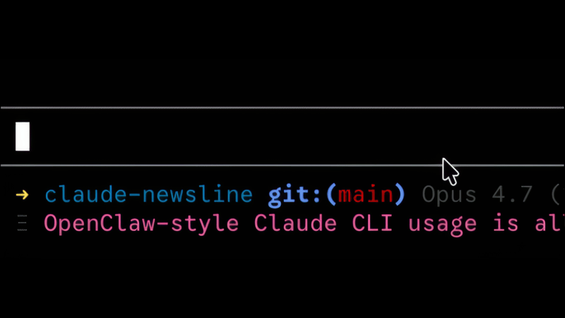

# claude-newsline

[](https://www.npmjs.com/package/@sitapix/claude-newsline)
[](https://github.com/sitapix/claude-newsline/actions/workflows/test.yml)
[](https://nodejs.org)
[](LICENSE)
[](https://claude.com/claude-code)

<a href="demo/demo.gif"></a>

## Install

```bash
npx @sitapix/claude-newsline
```

Shows what it'll change in `~/.claude/settings.json`, asks once, writes. Re-running is idempotent.

Adds a rotating Hacker News / r/programming / Lobsters headline to your [Claude Code](https://claude.com/claude-code) status line. Your existing `statusLine` stays put; this runs after it. Cmd-click (or Ctrl-click) a headline to open the story. The wizard asks which feeds to show, color, and how long each headline stays on screen.

## Flags

```bash
npx @sitapix/claude-newsline --only hn               # keep just one feed
npx @sitapix/claude-newsline --disable reddit        # drop one
npx @sitapix/claude-newsline --color bold_magenta    # name, raw SGR, or "none"
npx @sitapix/claude-newsline --rotation 30           # seconds per headline (default 20)
npx @sitapix/claude-newsline --motion static         # just switch, no scroll (also: slide, quick)
npx @sitapix/claude-newsline --yes                   # skip the prompt (CI)
npx @sitapix/claude-newsline --uninstall
```

`CLAUDE_CONFIG_DIR` is honored if set.

Writing your own feed? See [Developing: write a feed](#developing-write-a-feed). It's three vars (`LABEL`, `URL`, `JQ`) and a function.

Reddit rate-limits anonymous JSON requests. When a refresh tick gets a 429, that feed sits out until the next one and the last good cache line keeps showing. More subs in `--reddit-subs` means more requests per refresh, which is why the 15-entry cap exists.

## Requirements

Node 18+, plus `jq`, `curl`, and `bash 3.2+`. Default on macOS and most Linux distros.

## Terminals

Titles are wrapped in OSC 8 hyperlinks. They work in iTerm2, WezTerm, Kitty, Ghostty, GNOME Terminal, Konsole, and the VS Code terminal. macOS Terminal.app doesn't support them; the runtime detects Terminal.app and skips the escapes there. Force with `NEWSLINE_HYPERLINKS=always` or `never`.

[`NO_COLOR`](https://no-color.org), [`FORCE_COLOR`](https://force-color.org), and Claude Code's `FORCE_HYPERLINK` are all honored. `NO_COLOR=1` suppresses every ANSI color escape (including the reset). `FORCE_HYPERLINK=0`/`1` trumps our `NEWSLINE_HYPERLINKS` knob.

## Tuning

Override any of these via env (shell profile or `settings.json` under `"env"`). All user-facing env vars are namespaced with `NEWSLINE_` so they can't collide with host-shell vars (`PREFIX`, `CACHE_FILE`, and `SCROLL` are generic enough to belong to other tools):

| Variable | Default | Effect |
| --- | --- | --- |
| `NEWSLINE_FEEDS_DISABLED` | (none) | Comma-separated feeds to skip |
| `NEWSLINE_REDDIT_SUBS` | `programming` | Comma-separated reddit entries. See `--reddit-subs` above for the three accepted shapes. Capped at 15. |
| `NEWSLINE_CACHE_CHUNK` | `3` | Lines per feed per round-robin pass when building the cache. Lower = faster source variety, higher = longer dwell on one source. |
| `NEWSLINE_ROTATION_SEC` | `20` | Seconds per headline |
| `NEWSLINE_SCROLL` | `1` | Set to `0` to disable the scroll transition |
| `NEWSLINE_SCROLL_SEC` | `5` | Scroll duration in frames (Claude Code refreshes at 1 FPS, so the scroll is always a stepped slide: N discrete frames, not a smooth glide) |
| `NEWSLINE_REFRESH_SEC` | `600` | How often feeds are re-fetched |
| `NEWSLINE_MAX_TITLE` | `60` | Truncation point (bytes) |
| `NEWSLINE_COLOR_FEED` | `dim_yellow` | Color name, raw SGR (`38;5;208`), or `none` |
| `NEWSLINE_PREFIX` | `Ξ ` | Brand glyph rendered to the left of every headline (set `""` to disable) |
| `NEWSLINE_COLOR_PREFIX` | `dim` | Color for the prefix glyph |
| `NEWSLINE_SHOW_LABELS` | `1` | Set to `0` to hide the source label (just the title) |
| `NEWSLINE_LABEL_SEP` | ` • ` | Separator between label and title |
| `NEWSLINE_HYPERLINKS` | `auto` | `always` / `never` / `auto` |

Scroll smoothness is capped by `statusLine.refreshInterval`. Claude Code's minimum is 1 second (1 FPS). The installer sets it to `1` unless you already have one. At 1 FPS a 5s scroll is 5 discrete frames, which reads as a stepped slide rather than a smooth glide.

### Precedence

Config is resolved in the standard dotenv order, highest to lowest:

1. Shell environment (anything exported in `~/.zshrc`, `~/.bashrc`, your CI runner, etc.)
2. `settings.json` under `"env"` (what the installer writes)
3. Script default (the fallback baked into `statusline.sh`)

Shell env wins on the theory that the deploy environment knows more than the app does. Same ordering as [motdotla/dotenv](https://github.com/motdotla/dotenv) and Docker Compose. If something isn't applying the way you expect, run `NEWSLINE_DEBUG=1 bash ~/.claude/claude-newsline.sh` to see every knob's resolved value and where it came from.

## Developing: write a feed

Adding your own feed (think: plugin) is a one-file change. Each feed is a shell function in `bin/statusline.sh` that sets three vars:

- `LABEL`: short tag shown before the title (`HN`, `Lobsters`).
- `URL`: a JSON endpoint. RSS/Atom won't work without a conversion step.
- `JQ`: a jq filter that emits one line per headline as `label<TAB>title<TAB>url`.

Every `REFRESH_SEC` (default 600), the runtime runs, per feed:

```sh
curl -fsS --max-time 5 "$URL" | jq -r --arg default "$LABEL" "$JQ"
```

The jq filter is the parser. There's no schema detection. Open the endpoint once, see what you're working with, write the jq. `$default` is bound to `LABEL`; a filter can pass it through unchanged or rewrite it per-item (e.g. `feed_hn` promotes `Show HN:` / `Ask HN:` prefixes into their own labels at refresh time).

Lobsters is the simplest. Top-level array, title and URL already present:

```sh
feed_lobsters() {
  LABEL='Lobsters'
  URL='https://lobste.rs/hottest.json'
  JQ='.[] | select(.title != null) | [$default, .title, .short_id_url] | @tsv'
}
```

HN's Algolia API nests under `.hits[]` and you have to build the URL yourself:

```sh
feed_hn() {
  LABEL='HN'
  URL='https://hn.algolia.com/api/v1/search?tags=front_page&hitsPerPage=30'
  JQ='.hits[] | [$default, .title, "https://news.ycombinator.com/item?id=\(.objectID)"] | @tsv'
}
```

The real `feed_hn` in `bin/statusline.sh` is slightly more involved: it captures titles starting with `Show HN:` / `Ask HN:` / `Tell HN:` and promotes the prefix into its own label (so you see `Show HN` as the tag, not `HN`). The snippet above is the teaching version.

To add your own:

1. `curl <url> | jq .` and find the array of items.
2. Write a jq filter that extracts one tab-separated row (`label`, `title`, `url`) per item.
3. Dry-run it before touching the codebase:
   ```sh
   curl -fsS 'https://your-api.example/feed.json' \
     | jq -r --arg default 'MyFeed' '.items[] | [$default, .title, .url] | @tsv'
   ```
   If you see `MyFeed<TAB>title<TAB>url` lines, the feed will work.
4. Drop the `feed_<name>()` function into `bin/statusline.sh` and append `<name>` to the `ALL_FEEDS='...'` line at the top of the same file. The installer parses that line at load (`loadAllFeeds` in `bin/claude-newsline.js`), so JS stays in sync. `--only <name>` and `--disable <name>` will work straight away. The interactive wizard has a hardcoded feed picker in `runWizard` (`bin/claude-newsline.js`, look for the `multiselect({ message: 'Which feeds should rotate?' })` block), so if you want the new feed to show up there too, add a `{ label, value, hint }` entry.

### Parameterized feeds (one feed, N fetches)

If your feed takes a user-supplied list (like Reddit does with subreddits), declare it next to the function:

```sh
feed_myfeed() {
  _entry=$1                                # one list entry, e.g. "rust"
  case "$_entry" in
    ''|*[!A-Za-z0-9_]*) return 1 ;;        # reject bad entries
  esac
  LABEL="my/$_entry"
  URL="https://api.example/$_entry.json"
  JQ='.items[] | [$default, .title, .url] | @tsv'
}
FEED_PARAMS_myfeed='MYFEED_ENTRIES'        # env var holding the CSV
```

The dispatch loop in `refresh_all_feeds` sees `FEED_PARAMS_myfeed`, splits `$MYFEED_ENTRIES` on `,`, and calls `feed_myfeed` once per entry. Return non-zero to skip a bad entry without aborting the rest. See `feed_reddit` in `bin/statusline.sh` for the reference implementation.

## Roadmap

Loose list of things that might land later. No promises on timing.

- RSS/Atom. Feeds are JSON-only today because the jq filter is the parser. An `xq`/`yq` hop (or a small XML-to-JSON shim inside the runtime) would let the same three-var feed shape handle RSS/Atom endpoints.

## License

MIT.
